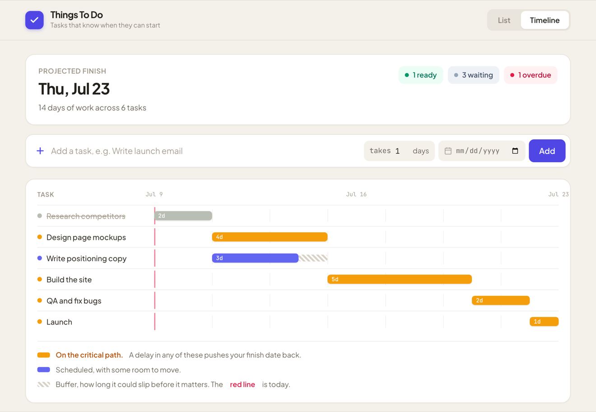

# Things To Do — project scheduler

A todo app where tasks have durations and dependencies, so the list doubles as a small project plan. The app computes each task's earliest possible start date and highlights the critical path across two views — a status-aware task list and a critical-path timeline. Built on the Soma Capital take-home starter (Next.js 14 + Prisma).

## Solution

All three parts are implemented, plus unit tests on the scheduling logic and an AI feature that breaks a todo into scheduled subtasks. The main design decision is that all graph and scheduling logic lives in a pure, framework-free module ([`lib/scheduling.ts`](lib/scheduling.ts)) that the API routes call into, so the algorithms can be unit-tested without a database or HTTP layer.


### Part 1: Due Dates

- The date input, previously unwired, is bound to the create form. `POST /api/todos` accepts an optional `dueDate` and stores it as UTC midnight.
- Due dates render on each card and turn red when past due. The comparison is date-only (`lib/dates.ts`), so a task due today is not overdue, and it compares the stored UTC calendar day against the user's local calendar day so it behaves correctly in any timezone.

### Part 2: Image Generation

- On creation, the server queries the Pexels search API with the todo title and saves `imageUrl` and `imageAlt` on the row (`lib/pexels.ts`). Fetching server-side keeps the API key off the client, and saving the result means the list never re-hits Pexels on render, which stays within rate limits.
- The UI shows a pulsing skeleton card while the create request is in flight, a skeleton tile until each image loads, and a neutral placeholder glyph when a todo has no image.
- A failed image lookup never blocks creation. A missing key, no results, a 4xx or 5xx, or a network error all resolve to "no image", and the todo is still created.

### Part 3: Task Dependencies

Schema: an explicit join model, so a todo can have many dependencies and many dependents.

```prisma
model TodoDependency {
  id          Int  @id @default(autoincrement())
  todoId      Int  // the dependent task
  dependsOnId Int  // the prerequisite task
  todo        Todo @relation("TodoDependencies", fields: [todoId], references: [id], onDelete: Cascade)
  dependsOn   Todo @relation("DependentTodos", fields: [dependsOnId], references: [id], onDelete: Cascade)
  @@unique([todoId, dependsOnId])
}
```

Each todo also carries a `durationDays`, editable inline, that feeds the schedule.

1. Multiple dependencies. Add or remove them via chips on each card, backed by `POST /api/todos/[id]/dependencies` and `DELETE /api/todos/[id]/dependencies/[depId]`.

2. Circular dependency prevention. Adding "A depends on B" is rejected when A is already reachable from B by walking prerequisite links (DFS over the full graph), which catches direct (A→B→A), transitive (A→B→C→A), and self cycles. The check and the insert run in one transaction (serializable on Postgres), so concurrent edits cannot slip a cycle through; see Concurrency below. Rejections return a 400 with both task titles, shown as a dismissible banner in the UI.

3. Critical path. This is the full Critical Path Method. A forward pass in topological order (Kahn's algorithm) computes each task's earliest start and finish, then a backward pass computes latest start and finish and slack (`slack = latestStart − earliestStart`; zero slack means the task is on a critical path). The longest path is backtracked from the task that finishes last and highlighted amber. When two branches tie, one deterministic path is highlighted. Classic CPM would mark every zero-slack task critical; highlighting a single path is a simplification for readability.

4. Earliest start dates. `earliestStart(task) = max(earliestFinish(prerequisites))`, anchored at today, and shown on every card. It is computed on read (`GET /api/schedule`) rather than saved, because saved state would go stale on every dependency or duration edit, while recomputing is O(V+E) and always correct at this scale.

5. Visualization. Two views, switchable from the header. The **List** view shows each task as a card with its computed start date, a live status (ready to start / waiting on N / overdue / done), a due date that turns red when overdue, and its prerequisites as removable chips. The **Timeline** view is a mini-Gantt on a shared day axis: each bar sits at the task's earliest start — amber on the critical path, indigo elsewhere — with a hatched buffer showing how far a task can slip before it moves the finish date, and a red marker for today.



### Beyond scope

- Completion & status. Any task can be checked off (a `done` flag on the row). The header summarizes the projected finish date plus how many tasks are ready, waiting, or overdue, and each card derives its own status from its due date and whether its prerequisites are done.
- AI task decomposition. The sparkle button on any todo calls `POST /api/todos/decompose`, which asks Claude (via OpenRouter, JSON output) for 2 to 8 subtasks with estimated durations and inter-subtask dependencies. The response is strictly validated (`parseDecomposition` checks index bounds, self-edges, duplicate pairs, and size limits) and cycle-checked with the same engine before anything is written. Subtasks and edges are created in one transaction, and the original todo becomes dependent on all of them. Without `OPENROUTER_API_KEY` the endpoint returns a friendly 503.
- Unit tests. `npm test` runs 32 Vitest tests covering cycle detection (self, direct, transitive, redundant-edge), topological sort, critical path and slack on diamond graphs with unequal branch weights, disconnected components, overdue date logic, the Pexels client (mocked fetch and error paths), and the LLM response validator.

### Concurrency

The cycle check and the dependency insert happen in a single transaction that reads the graph inside the transaction. On Postgres it runs at serializable isolation, so two simultaneous additions that are each individually acyclic cannot both commit; the loser gets a retryable 409. SQLite (local dev) serializes writes, so the in-transaction check is enough there. As a further safeguard, `GET /api/schedule` degrades gracefully (a zeroed schedule plus a `cyclic` flag) rather than returning a 500 if a cycle is ever present.

### Setup

```bash
npm i
cp .env.example .env   # PEXELS_API_KEY (images) and OPENROUTER_API_KEY (AI decompose), both optional
npx prisma migrate dev
npm run dev
npm test
```

Local dev uses SQLite with zero configuration.

### Deploy (Vercel)

SQLite does not persist on Vercel's serverless filesystem, so production uses Postgres via a separate schema ([`prisma/schema.production.prisma`](prisma/schema.production.prisma), with identical models). Local dev is untouched.

1. Import the repo into Vercel and add the Vercel Postgres integration (which sets `DATABASE_URL` automatically), or paste any Postgres URL.
2. Add `PEXELS_API_KEY` and `OPENROUTER_API_KEY` as environment variables. Both are optional; the app runs without them.
3. The build (`npm run vercel-build`) generates the Postgres client and applies the schema before `next build`.
