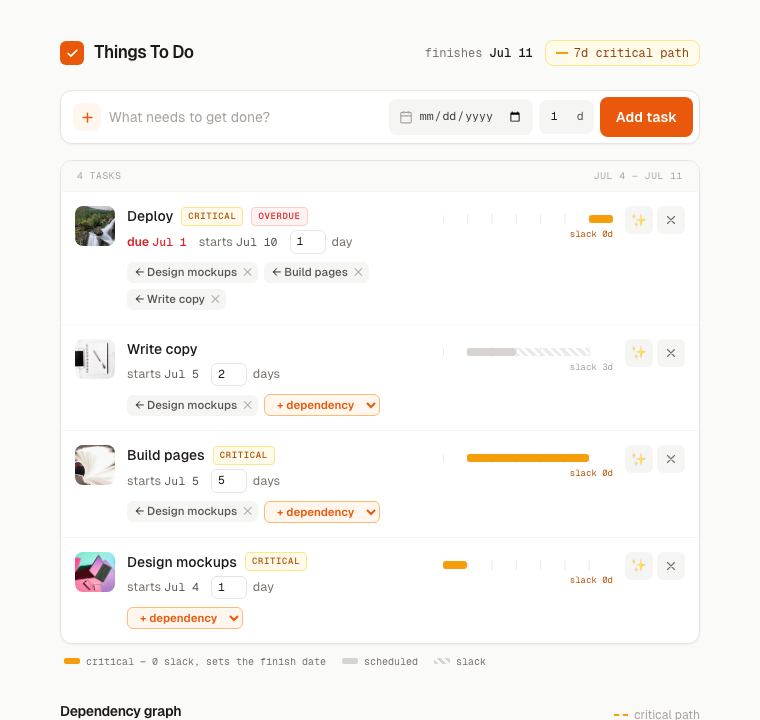
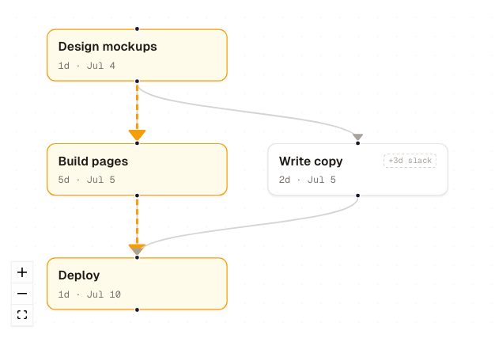

# Things To Do — project scheduler

A todo app where tasks have **durations and dependencies**, so the list becomes a mini project plan: the app computes each task's **earliest possible start date** and highlights the **critical path**, with an interactive dependency-graph view. Built on the Soma Capital take-home starter (Next.js 14 + Prisma).

## Solution

All three parts are implemented, plus unit tests on the scheduling logic and an AI feature that decomposes a todo into scheduled subtasks. The core design decision: all graph/scheduling logic lives in a pure, framework-free module ([`lib/scheduling.ts`](lib/scheduling.ts)) that the API routes consume — so the interesting algorithms are unit-testable without a database or HTTP layer.



### Part 1: Due Dates

- The (previously unwired) date input is bound to the create form; `POST /api/todos` accepts an optional `dueDate` and stores it as UTC midnight.
- Due dates render on each card and turn **red when past due**. The comparison is date-only (`lib/dates.ts`) — a task due *today* is not overdue — and compares the stored UTC calendar day against the user's local calendar day so it behaves correctly in any timezone.

### Part 2: Image Generation

- On creation, the server queries the Pexels search API with the todo title and persists `imageUrl`/`imageAlt` on the row (`lib/pexels.ts`). Fetching server-side keeps the API key off the client, and persisting means the list never re-hits Pexels on render (rate-limit friendly).
- The UI shows a pulsing skeleton card while the create request is in flight, a skeleton tile until each image loads, and a neutral placeholder glyph when a todo has no image.
- Failure is never fatal: missing key, no results, 4xx/5xx, or network errors all resolve to "no image" and the todo is still created.

### Part 3: Task Dependencies

**Schema** — an explicit join model, so a todo can have many dependencies and many dependents:

```prisma
model TodoDependency {
  id          Int  @id @default(autoincrement())
  todoId      Int  // the dependent task
  dependsOnId Int  // the prerequisite task
  todo        Todo @relation("TodoDependencies", fields: [todoId], references: [id], onDelete: Cascade)
  dependsOn   Todo @relation("DependentTodos", fields: [dependsOnId], references: [id], onDelete: Cascade)
  @@unique([todoId, dependsOnId])
}
```

Each todo also carries a `durationDays` (editable inline) that feeds the schedule.

**1. Multiple dependencies** — add/remove via chips on each card; `POST /api/todos/[id]/dependencies`, `DELETE /api/todos/[id]/dependencies/[depId]`.

**2. Circular dependency prevention** — adding "A depends on B" is rejected iff A is already reachable from B by walking prerequisite links (DFS over the full graph), which catches direct (A→B→A), transitive (A→B→C→A), and self cycles. The check and the insert run in **one transaction** (serializable on Postgres) so concurrent edits can't slip a cycle through — see *Concurrency* below. Rejections return a 400 with both task titles, surfaced as a dismissible banner in the UI.

**3. Critical path** — full Critical Path Method: a **forward pass** in topological order (Kahn's algorithm) computes each task's earliest start/finish, then a **backward pass** computes latest start/finish and **slack** (`slack = latestStart − earliestStart`; zero slack ⇔ on a critical path). The longest path is backtracked from the task that finishes last and highlighted amber. When two branches tie, one deterministic path is highlighted (classic CPM would call every zero-slack task critical — a deliberate simplification for readability).

**4. Earliest start dates** — `earliestStart(task) = max(earliestFinish(prerequisites))`, anchored at today. Shown on every card. This is **computed on read** (`GET /api/schedule`), not persisted: derived state goes stale on every dependency/duration edit, while recomputing is O(V+E) and always correct at this scale.

**5. Visualization** — two views. Each task row carries an inline **schedule rail** (a mini-Gantt): the task's bar positioned across the project span, amber and tiling end-to-end for the critical path, gray with a hatched **slack** extension for tasks that can slip. Below, an interactive React Flow graph (dagre auto-layout, left→right on the same time axis) with the critical path in amber dashed edges and a slack badge on off-path nodes.



### Beyond scope

- **✨ AI task decomposition** — the sparkle button on any todo calls `POST /api/todos/decompose`, which asks Claude (via OpenRouter, JSON output) for 2–8 subtasks with estimated durations and inter-subtask dependencies. The response is strictly validated (`parseDecomposition` — index bounds, self-edges, duplicate pairs, size limits) and cycle-checked with the same engine before anything is written; subtasks + edges are created in one transaction and the original todo becomes dependent on all of them. Without `OPENROUTER_API_KEY` the endpoint degrades to a friendly 503.
- **Unit tests** — `npm test` (Vitest, 32 tests) covers cycle detection (self/direct/transitive/redundant-edge), topological sort, critical path and **slack** on diamond graphs with unequal branch weights, disconnected components, overdue date logic, the Pexels client (mocked fetch, error paths), and the LLM response validator.

### Concurrency

The cycle check and the dependency insert happen in a single transaction that reads the graph *inside* the transaction. On Postgres it runs at **serializable** isolation, so two simultaneous additions that are each individually acyclic can't both commit — the loser gets a retryable `409`. SQLite (local dev) serializes writes, so the in-transaction check is sufficient there. As defense in depth, `GET /api/schedule` still degrades gracefully (zeroed schedule + a `cyclic` flag) rather than 500-ing if a cycle is ever present.

### Setup

```bash
npm i
cp .env.example .env   # PEXELS_API_KEY (images) and OPENROUTER_API_KEY (AI decompose) — both optional
npx prisma migrate dev
npm run dev
npm test
```

Local dev uses SQLite with zero configuration.

### Deploy (Vercel)

SQLite doesn't persist on Vercel's serverless filesystem, so production uses **Postgres** via a separate schema ([`prisma/schema.production.prisma`](prisma/schema.production.prisma), identical models). Local dev is untouched.

1. Import the repo into Vercel and add the **Vercel Postgres** integration (sets `DATABASE_URL` automatically), or paste any Postgres URL.
2. Add `PEXELS_API_KEY` and `OPENROUTER_API_KEY` as environment variables (optional — the app runs without them).
3. The build (`npm run vercel-build`) generates the Postgres client and applies the schema before `next build`.
